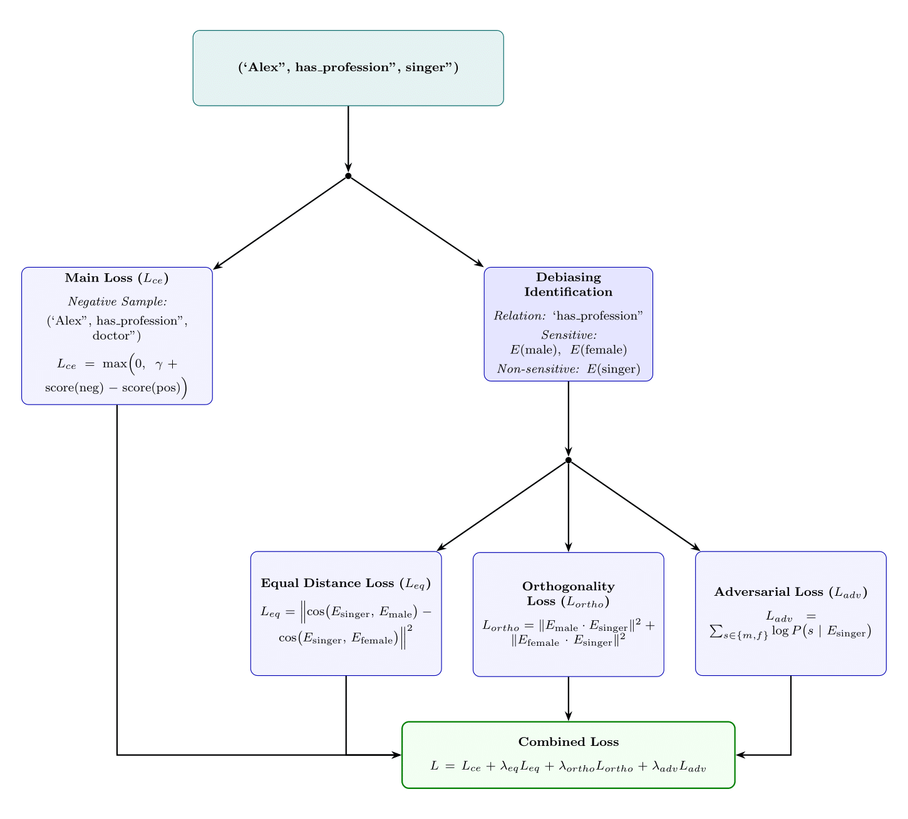

# Debiasing Knowledge Graph Embeddings in FB15k-237  

[](https://pytorch.org/)  
[](LICENSE)  

A project focused on mitigating gender bias in knowledge graph embeddings using adversarial training and regularization techniques. Built on the FB15k-237 dataset and PyTorch Geometric.  

  

---  

## 📖 Table of Contents  
1. [Overview](#overview)  
2. [Features](#features)  
3. [Installation](#installation)  
4. [Usage](#usage)  
6. [File Structure](#file-structure)  
7. [Contributing](#contributing)  
8. [License](#license)  
9. [References](#references)  

---  

## 🌟 Overview  
This project addresses gender bias in knowledge graph embeddings by enhancing the TransE model with:  
- **Adversarial debiasing** to reduce gender-sensitive correlations.  
- **Equality and Orthogonality Loss** for fairer entity representations.  
- **Bias score analysis** to quantify improvements pre- and post-debiasing.  

Targeted at the FB15k-237 dataset, it identifies biased profession-gender associations and mitigates them through gradient reversal and constraint-based optimization.  

---  

## 🚀 Features  
- **Dataset Handling**: Custom `FB15kDataset` class for seamless data loading.  
- **Debiased TransE Model**:  
  - Adversarial component to obfuscate gender information.  
  - Equality loss for distribution alignment.  
  - Orthogonality loss to decouple sensitive attributes.  
- **Bias Analysis**:  
  - Profession-gender ratio calculations.  
  - Visualization of bias scores using `matplotlib`.  

---  

## 📥 Installation  

### Dependencies  
- Python 3.8+  
- PyTorch 2.0+  
- PyTorch Geometric  
- pandas  
- numpy  
- matplotlib  

```bash  
# Install PyTorch (visit https://pytorch.org/ for CUDA versions)  
conda install pytorch torchvision torchaudio -c pytorch  

# Install PyTorch Geometric  
pip install torch-geometric  

# Install remaining dependencies  
pip install pandas numpy matplotlib  
```  

### Data Preparation  
1. Download the [FB15k-237 dataset](https://github.com/DeepGraphLearning/KnowledgeGraphEmbedding) and place it in `FB15k/raw/`.  
2. Ensure auxiliary files are present:  
   - `gen2prof_fair_all.txt`: Profession-gender mappings.  
   - `FB15k_mid2name.txt`: MID-to-entity name mappings.  

---  

## 🛠 Usage  

### Training the Model  
```bash  
python training_code_final.py  
```  
**Key Arguments** (modify in-code):  
- `lambda_eq`: Equality loss weight (default: `0.1`).  
- `lambda_ortho`: Orthogonality loss weight (default: `0.1`).  
- `lambda_adv`: Adversarial loss weight (default: `0.1`).  

### Analyzing Gender Ratios  
```bash  
python freq.py  
```  
Outputs:  
- Top 10 male/female-dominated professions.  
- Profession counts and male-to-female ratios.  

### Visualizing Bias Scores  
```bash  
python analysis.py  
```  
Generates:  
- `final_bias_scores_debiasing.json`: Post-debiasing scores.  
- `final_bias_scores_no_debiasing.json`: Pre-debiasing scores.  
- Interactive bar plots comparing bias scores.  

---    

## 📂 File Structure  
```  
.  
├── FB15k/                     # Dataset directory  
│   └── raw/                   # Raw dataset files  
├── training_code_final.py     # Main training/evaluation script  
├── freq.py                    # Profession-gender ratio analysis  
├── analysis.py                # Bias score visualization  
├── gen2prof_fair_all.txt      # Profession-gender mappings  
└── FB15k_mid2name.txt         # MID-to-entity name mappings  
```  

---  

## 🤝 Contributing  
1. Fork the repository.  
2. Create a feature branch:  
   ```bash  
   git checkout -b feature/new-feature  
   ```  
3. Commit changes:  
   ```bash  
   git commit -m 'Add new feature'  
   ```  
4. Push to the branch:  
   ```bash  
   git push origin feature/new-feature  
   ```  
5. Submit a pull request.  

---  

## 📜 License  
This project is licensed under the MIT License. See [LICENSE](LICENSE) for details.  

---  

## 📚 References  
- **FB15k-237**: [Dataset Paper](https://arxiv.org/abs/1806.07297)  
- **TransE**: [Translating Embeddings for Modeling Multi-relational Data](https://papers.nips.cc/paper/5071-translating-embeddings-for-modeling-multi-relational-data)  
- **Adversarial Debiasing**: [Mitigating Unwanted Biases with Adversarial Learning](https://arxiv.org/abs/1801.07593)